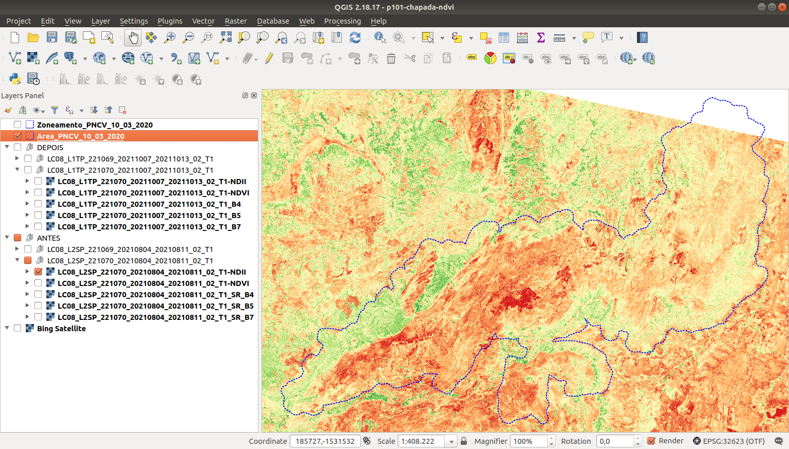

## Landsat-8

### NDII - Antes

### NDII - Depois

### Fórmula

**NDII = (B5 - B7) / (B5 + B7)**

### Referências

#### Obtenção de atributos de pastagens por meio de imagens do Sensor OLI/Landsat-8

https://www.embrapa.br/busca-de-publicacoes/-/publicacao/1126298/obtencao-de-atributos-de-pastagens-por-meio-de-imagens-do-sensor-olilandsat-8

