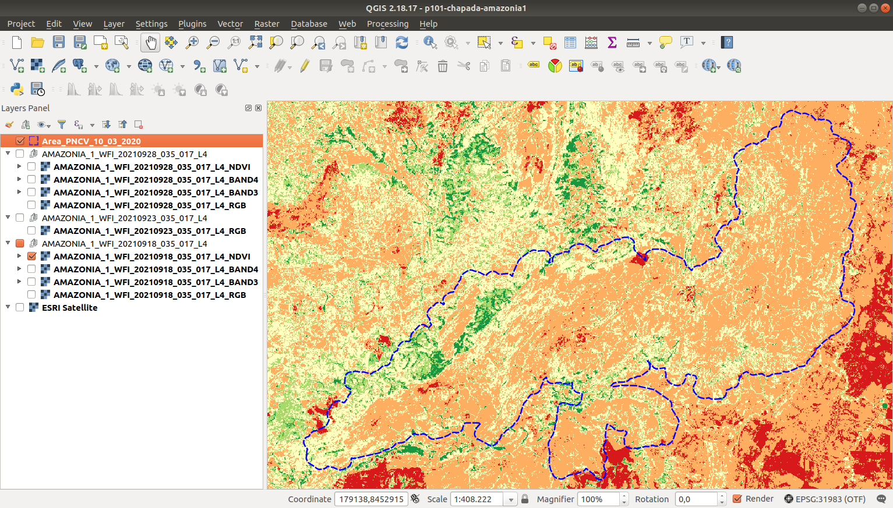
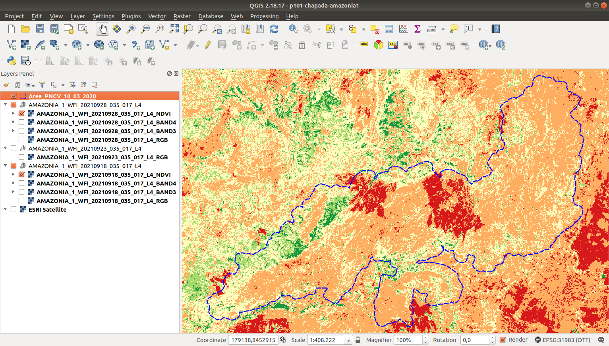

## Amazônia-1

### NDVI - Antes

### NDVI - Depois

### Fórmula

**NDVI = (B4 - B3) / (B4 + B3)**

### Referências

#### Satélite Amazonia-1 – Número de Bandas e outras Especificações Técnicas

https://www.instrutorgis.com.br/amazonia1-numero-de-bandas/

